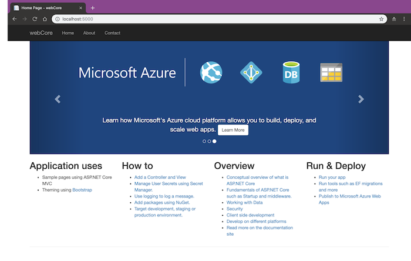

Microsoft has already released its dotnet core framework for a long time, which is an open-source and cross-platform framework. I decided to learn it from now on, and I want to write something for a record.

## The first step
If you are using Windows as your development environment, you might agree that Visual Studio is a very outstanding IDE tool. Actually, it is the best IDE tool I have ever used. Therefore, I chose Visual Studio for Mac.

<https://visualstudio.microsoft.com/vs/>

You can easily refer to the above website to download and install the community version for free. Just like install other software products on PC or Mac.
If you are not going to install Visual Studio, you can also refer to the dotnet core repository for more detail information about it. You may use the other way to build your dotnet core app.

<https://github.com/dotnet/aspnetcore>

## The first App
```plain
IDE version: Visual Studio 2017 for Mac Community 7.7.2 (build 21)
Framework version: 2.1
```
It is very easy to create my first Web App. Firstly, I followed the online tutorial document on the Microsoft website.

<https://docs.microsoft.com/en-US/aspnet/core/getting-started/?view=aspnetcore-2.2&tabs=macos>

Then, I opened Visual Studio for Mac to create a new solution. In **“New Project”** window, I chose **“.Net Core” -> “App” -> “ASP.Net core Web App (MVC)”** to create my first Web App. In a few seconds, you can finish your first Web App.
Actually, we have not written any line of code here, but we already had a simple website from the sample code. Next, chose **“Run” -> “Start without Debugging”**, you will see a web page like the below picture in your default browser.



Congratulations! We just started our journey in the world of dotnet core! In the following articles, I will try to integrate this simple website with a CI tool.
