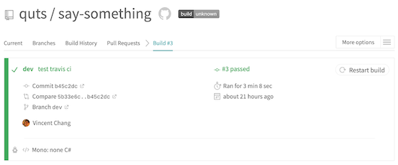
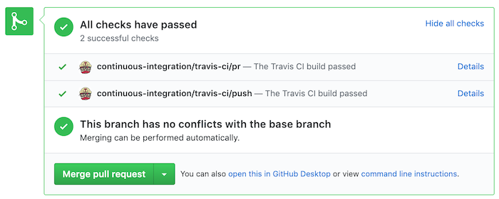
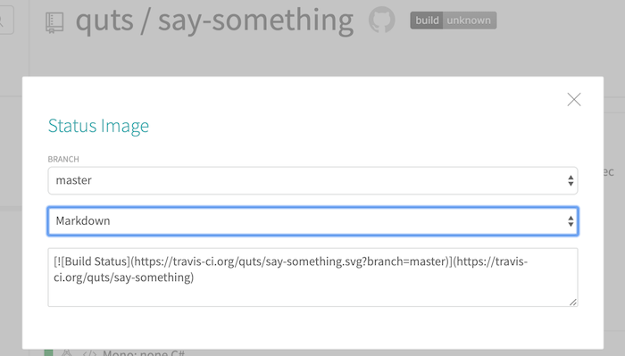

If you working in a software company, you will have a lot of teammate with you. Someone work on developing, someone working on testing, and someone working on DevOps. However, when you are working on a personal side project, you might feel trouble for those tasks beyond coding. Fortunately, in this beautiful world, we have many resources are free or almost free, such as Github, Travis CI, and Heroku, which helps us manage source code, continues delivery and release in an easier way.
# Link your Github repository with Travis CI
If you start from the first article in this series, you will know it is just a note for myself, so I am not going to introduce how to put your project on Github. However, it is my first time to integrate my project with Travis CI. So I am going to not something here.

<https://travis-ci.org/>

1. Visit Travis CI, and then login with your GitHub account.
2. On your left-hand side, there is a “+”, press it to add a new repository to your Travis CI account.
3. If you log in with your GitHub account, you will see repositories belong to your GitHub account here.
4. Switch on the repository that you want to integrate with Travis CI.


Then, you will find out that it is nothing happening here :)

# Add .travis.yml to your repository
Yes, we expect nothing going to happen here since there is no file called ***“.travis.yml”*** to tell Travis CI what going to do. You might want to study the document of Travis CI first, but I just note what I am doing here.

1. Add a file called ***“.travis.yml”***
2. Since dotnet core using c#, so we declare the using language as ***“csharp”*** here. From the document, the first line must declare the using language. Additionally, you can also declare the framework version you used here.
```plaintext
language: csharp
mono: none
dotnet: 2.1.502
```
3. Commit to your GitHub repository, and see what happen now.



You may notice that there is a badge here, and it still unknown even my repository is passed. We will use this later, let's see more thing that Travis CI helps us.

# Check before merge branches
Personally, I will commit to the dev branch and deploy to the staging server for more testing and merge to the master branch before release. For testing the integration with Travis CI, we just create a PR here to see what will happen.



In your pull request ticket, there will be a check result finished by Travis CI, and you can refer to this result to see if approved the “Merge pull request”. If you have a unit test, Travis CI will also tell you the result, you will confidence to press the button. Since it is my personal side project, and it just in the beginning stage, I will just merge it:)

# Add a badge to your repository
Remember that we have an “unknown status” badge in the previous section? You should able to see “passing” here since we merged to the master branch.


It still a little inconvenience if we need to come to this page for checking the status of the build. If it can show the real status about build result, we want to add the badge to the repository.

1. Click the badge “build|unknown”
2. Choose your branch, and select “Markdown”
3. Copy the markdown string and paste to README.md of the repository



4. Now you will able to see the result about the build result.


Let us have a short break here and congratulations!! we just finish a simple integration with Travis CI! In the following articles, I am going to try to integrate this with the docker build process.