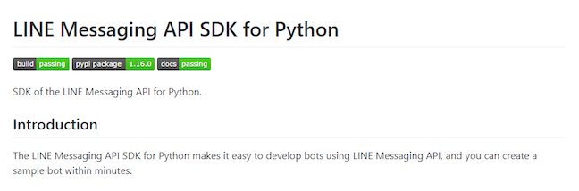

Here is what our project do in the past. We commit our change to the version control system and submit a “build” through the build system. Whenever it close to a project milestone, I was nervous about the code change that I just commit until a “build” comes out correctly. Why? I don’t want to make everyone waste hours to wait for the next build. To avoid this, sometimes you will make a build in local before you commit the change and you perform a series of test to make sure everything goes as usual. But have you ever forget about it? What if we have an automatic system to complete all the things on your checklist before the change made on the master branch?

我們的專案是如何在進行持續整合這件事呢? 通常我們會把我們的改動提交到版本控制系統，然後從系統發布一個新的版本，我們稱作build。所以每次當我們很靠近需要發布穩定版本(milestone build)的時候我就特別緊張，深怕自己又搞壞了什麼，然後又再浪費大家幾個小時。你會說那我們就在本地端做一個build，然後做些相關的測試再提交到版控就好啦。是阿，但總是會有忘記或是不小心漏掉東西的時候。如果這時候可以有一個自動化的系統，在程式碼真正提交到主線之前，做完所有該做的檢查，是否就讓人安心許多呢?

It is something fascinating about this in open source projects, and here is an example from a Python library for LINE. There is a badge in the readme file to tell everybody last change can make a build and pass all automation test.

在開源專案當中，就有類似的實作，以LINE的Python SDK為例，在說明文件當中就有一個標籤告訴你最新的程式碼可以通過所有的自動化測試案例而且可以出一個build



This kind of practice is already popular in open source projects, and it can also apply to enterprise projects. Here is the LINE SDK, they use Travis CI, and in our company, there is a Jenkins service to make the same thing, and all I need to do is some API cascading. Here is our goal for the first stage,
1. Make a build when everyone tries to merge to the master branch, a.k.a. a Pull-Request build (PR build).
2. A PR build should merge the latest master branch before making a build.
3. After a PR build made, perform some test to make sure everything goes right.
4. After a PR merged, it must able to create a build success, and pass all unit test.

所以開源專案可以，商業軟體為什麼不行？以剛剛的LINE Messaging API SDK for Pyhton來說這裡用的是Travis CI，但我們公司用的是Jenkins，其實稍微做一點串接，我們也是可以做到一樣的效果。我們的目標是做到這樣
1. 當改動提交到主線之前，必須要能夠產出一個build，我們稱作Pull-Request build或是PR build
2. PR build應該同時包含欲提交的改動以及主線上所有的程式碼，所以你或許需要把主線的改動merge到分支
3. 當PR build產出之後，進行相關的自動化測試確保一切如同過往一樣
4. 所以當一個Pull-Request被merge之後，不會影響build產出的結果

# Set up your Jenkins
We have an engineer productivity team in our company, so I don’t need to set up my own Jenkins server. But I can not post anything from my company to public site, so let fetch some pictures from a private Jenkins. And if you need a try, you can follow this article to get a docker image with Jenkins.
<https://medium.com/@gustavo.guss/quick-tutorial-of-jenkins-b99d5f5889f2>
<https://quts.github.io/post/2020-03-27-ubuntu-wsl/>

# 架設你的Jenkins環境
其實在我們公司有個特別的部門會幫大家打理一切，所以我其實沒有自己架設一台Jenkins server，但我其實不能把這些公司的東西直接張貼上來，所以讓我們來生一台自己的Jenkins server吧！基本上你可以找個docker image然後就簡單獲得這台Jenkins，所以就讓我們直接跳過這部分，直接參考前人的智慧吧！
<https://ithelp.ithome.com.tw/articles/10200621?sc=iThelpR>
<https://quts.github.io/post/2020-03-27-ubuntu-wsl/>

# Pipeline Job
To be honest, the first time I was using Jenkins, I choose “Free Style” project, and I will suggest you start from here. Because it is easy to understand what Jenkins helps you. However, when you begin to manage more than one build job, you probably what to make it version controllable and make settings as a code. The pipeline script is excellent and more than this.
# 流水線作業
我必須誠實的說，我第一次使用Jenkins的時候我選擇的是Free Style的Job，我其實也建議第一次用的人應該試試看Free Style Job，因為他簡單易懂而且也蠻強大的。但是，當你要開始管理超過一個以上的Build Job，相信你會希望能夠有一個東西是可以被版控的，甚至是可以代碼化的。在Jenkins的世界中，Pipeline Job就是一個很好的選項，而且他的好處不僅是代碼化與版控。
# My first pipeline
So far, you already know how to set up a Jenkins environment in local, and the reason to choose the Pipeline job. The next topic would be how to start your the first pipeline script and how the Jenkins helps us? When we start to learn a new language, it always starts from how to print “Hello World” on the screen. Let us prepare a script file in below, you may able to name this “Jenkinsfile” or “HelloWorld.groovy”. I like to use the extension “.groovy” since the text editor will highlight text for me :)

到這邊，你大概對於如何生一個Jenkins環境還有為什麼應該選擇Pipeline Job有了一些想法，所以我們也要來做一個簡單的流水線作業。當然不免俗的要向學習其他程式語言一樣，我們也來Hello World一下。首先呢，把下面這些東西存成一個檔案，你可以用Jenkinsfile或是HelloWorld.groovy當作檔名。如果你用“.groovy”當作副檔名，那有些文字編輯器會幫你做高亮度表示，所以我通常都會這樣子命名我的檔案 :)
```groovy
pipeline {
    agent any
    stages {
        stage('Hello') {
            steps {
                script {
                    echo 'World'
                }
            }
        }
    }
}
```
Right here, let us quickly explain the behaviour of this script.
- Line#1. It is a pipeline script, and it is the entry point of the script
- Line#2. It can be executed on every Jenkins node
- Line#3. It starts to do some stages
- Line#4. The current stage is “Hello”
- Line#5. It starts to do some steps
- Line#6. The current step is about some script
- Line#7. Print “World” into the log console

OK, commit it to your repository and move to the next section.

讓我們簡單的說明一下這一段Script的內容
- 第1行，這是一個Pipeline
- 第2行，它可以被運行在任何Jinkins Node上
- 第3行，開始是一些stages
- 第4行，目前這個stage叫做 “Hello”
- 第5行，開始做一些steps
- 第6行，目前這個step是一些script
- 第7行，把 “World” 印到螢幕上

好喔，把它們提交到你的版控吧！