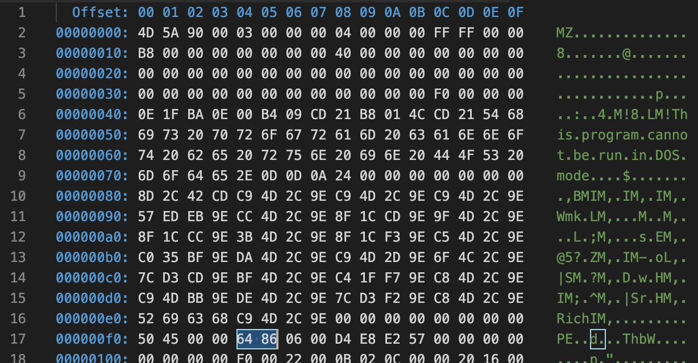

身為Endpoint產品的工程師，通常都會遇到各種奇奇怪怪的情況，有時候是設計上並不周全，有時候是環境使然，有時候就是怪怪的需要大家一起猜猜看，
所以大夥也都各自練就一身奇奇怪怪的功夫。今天想談的一個小故事是前一陣子我們QA敲給我的一個case，大意是說某個system services上了hotfix就一睡不起。
但其實那個hotfix沒有做任何的code change，單純就是換了某個module team來的DLL，而且module team再三保證測試如同以往一樣到位，
所以這種smooky test等級的錯誤，基本上是不可能發生的。
最後我們發現因為某些特殊的狀況，這個測試環境並不是透過CI產生的hotfix進行部署的，而是人工做出來的，
所以會有複製到錯誤檔案的風險，加上load DLL的部分並沒有明確的error message可供追蹤。
大概是以前自己做QA的時候也犯過這種錯誤吧，所以我的第一個反應就是包錯檔案拉!!!

但我也不禁好奇
## 所以，當有人直接拿個檔案問你的時候，你怎麼知道那是x86還是x64的檔案？

其實就把這樣的疑惑拿去餵狗，大家的好朋友谷歌就會告訴我們答案了，而這個答案自然與PE file format脫不了關係        
讓我們看一下微軟是怎麼說的，首先呢是PE file有很多不同的區塊，當然我不是這方面的專家，我是看不懂大部分的內容，但是呢我看到[這個](https://docs.microsoft.com/en-us/windows/win32/debug/pe-format#signature-image-only)
```plaintext
After the MS-DOS stub, at the file offset specified at offset 0x3c, is a 4-byte signature that identifies the file as a PE format image file. This signature is "PE\0\0" (the letters "P" and "E" followed by two null bytes).
```
文件告訴我們，身為一個PE file，那一定在檔案的0x3c這個固定的位置有一個區塊寫著PE\0\0這樣的字，
接著在他的後面則是COFF File Header這個區塊，COFF File Header的開頭就是Machine type，然後Machine type的[定義](https://docs.microsoft.com/en-us/windows/win32/debug/pe-format#machine-types)是
```plaintext
The Machine field has one of the following values that specifies its CPU type. An image file can be run only on the specified machine or on a system that emulates the specified machine.
```
所以說，如果我們不小心把x86的DLL拿去給x64的程式load，他會因為這個machine type load不起來，所以我們就檢查這個machine type的位置填著什麼樣的數值既可以結案了！把剛剛關於machine type的定義繼續往下讀，我們會找到屬於x64還有x86機器的定義分別是0x8664以及0x014c
```plaintext
IMAGE_FILE_MACHINE_AMD64    0x8664    x64
IMAGE_FILE_MACHINE_I386     0x14c     Intel 386 or later processors and compatible processors
```

## 所以，知道這些有幫助嗎？我又不是電腦，我看得懂嗎？

對啊，我是一般人，我哪知道哪個偏移量的數值是多少？所以我裝了[hexdump for VSCode](https://marketplace.visualstudio.com/items?itemName=slevesque.vscode-hexdump)，這樣我可以在文字編輯器就看到檔案當中16進位的樣子


好喔，所以我一眼就看穿offset 0x3c的附近寫著0x8664嗎？不！尤其這張圖還是little endian，每個offset上的數值跟spec上寫的順序還是相反的！
但是，還記得前面我們說的，在檔案的0x3c寫的是PE\0\0嗎？
現在的hex viewer都很貼心，
在右半邊通常都會幫你翻譯承你看得懂的字所以你看到```0x455000```被翻譯成```PE..```，然後在他的後面就是```0x8664```

ＢＩＮＧＯ！這下真的結案了，這是一個64位元的檔案！

# Reference
- https://docs.microsoft.com/en-us/windows/win32/debug/pe-format