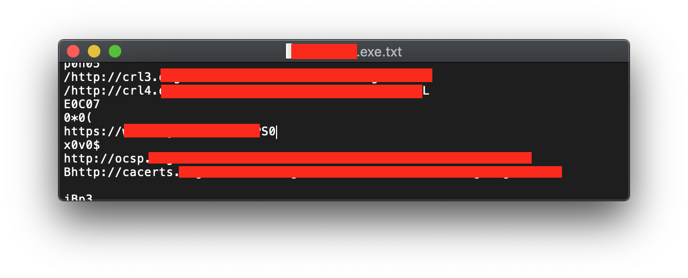

身為一個對資訊安全有興趣的攻城獅，接受過一些基本的檔案分析訓練也是合情合理的。
只是長期待在產品部門的我，對於這種事情雖然知道可能可以怎麼開始，但說真的不擅長。
當我第一次看到講師只是單純把一個檔案裡面所有的字直接傾印出來，就能夠宣稱這是惡意檔案因為他看到xxx API被調用了，我就確定檔案分析不是我有能力深耕的領域，哈哈。
因此怎麼做這件事對我而言一直都是屬於冷知識的範疇。因為我個人真的不常用嘛～

但怎麼也沒想到，這後來又成就了是我一項奇奇怪怪的功夫了！故事是這樣的，有一天又有一位QA同事拿著檔案問我，這個還可以用嗎？裡面的token過期了嗎？
其實token這種東西本來就是為了過期而存在的，所以一開始我還真的不知道該怎麼回答他，我只能跟他說，你就重新生一個新的token吧！
# 但我又想到
# 會不會有哪個有熱情的研究員
# 因緣際會拿到一個這樣的檔案，然後就不小心反組譯了它
# 然後就發現了一個漏洞呢？

當然，通常越有風險性的token過期的速度會越快，就算被你拿到了也沒什麼可怕的，但被人透析token擺放的固定位置就是一件可怕的事了！
但想像中能有這樣的攻擊手法，總也是要有個概念性的驗證，才能說服自己把資源投注在這種具有潛力但是不太會被重視的Bug上面
於是乎我找到了[Bintext](https://www.aldeid.com/wiki/BinText)，因為官網的截圖還蠻明顯的，這裡就不放了
簡單的說就是你把檔案餵給他，他就會把檔案裡面純文字的提取出來變成一個列表給你。
在Linux或是Mac，你則是可以用strings這個command獲得幾乎一樣的結果
所以如果有人把什麼機密的資料用一串連續的文字儲存，很可能你就可以直接看到
不過你也要夠有慧根，可以很快看穿那是敏感資料就是了

有時候dump出來的資料其實就是人看得懂的文字，有時候只是一些網址啊或是API之類的，但假設你hardcode了什麼重要的字串，其實偷看他真的不需要什麼高深的技巧
不說了，我要回頭敲張bug給自己好壓壓驚